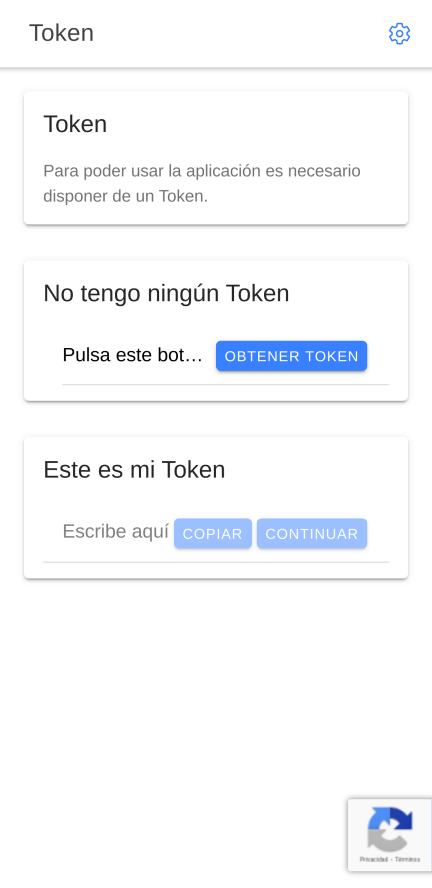
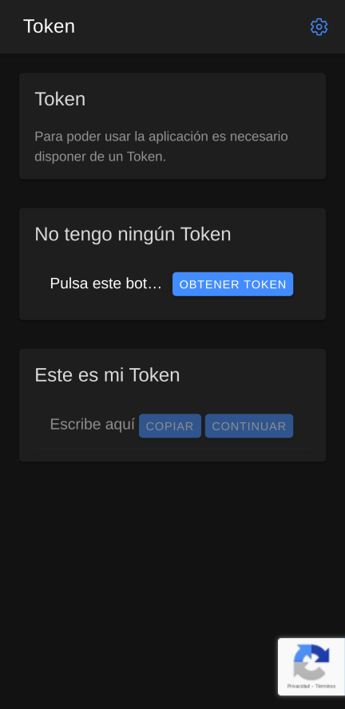
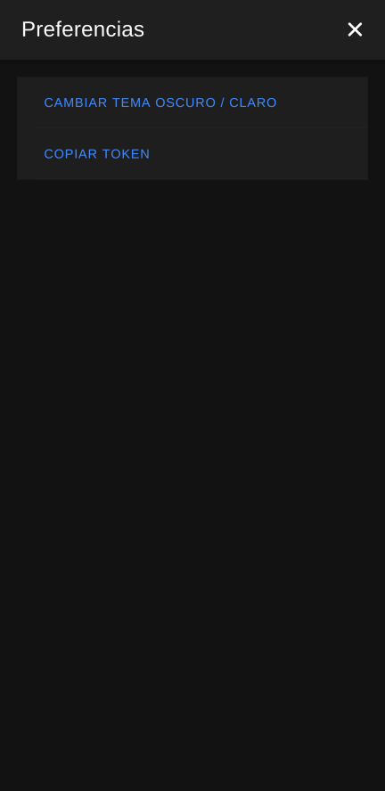
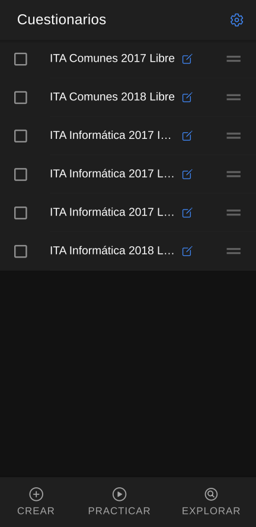
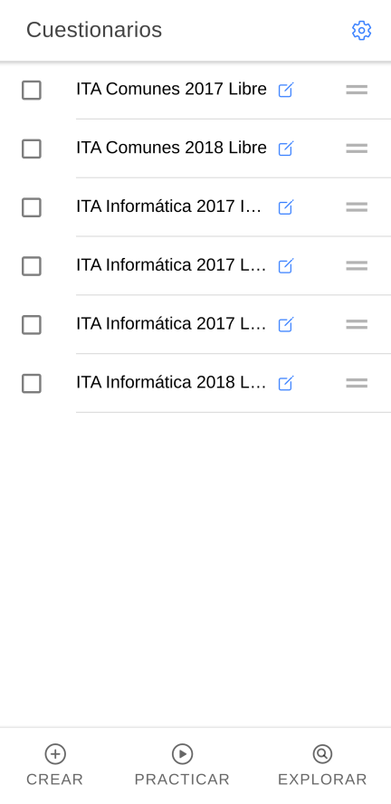
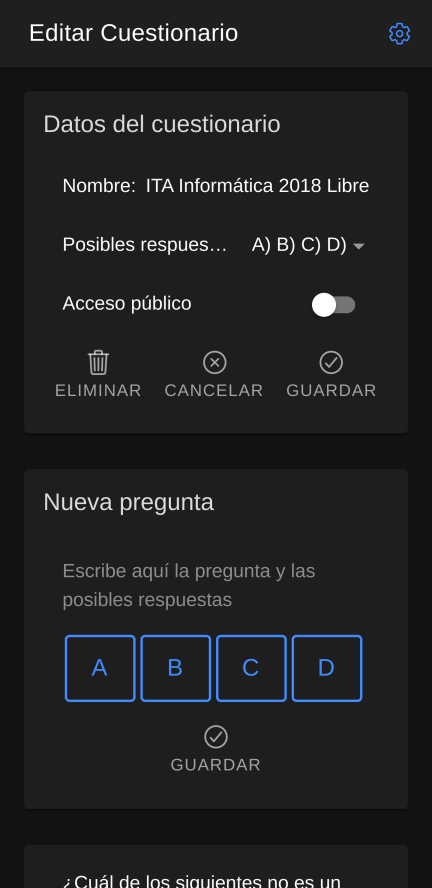
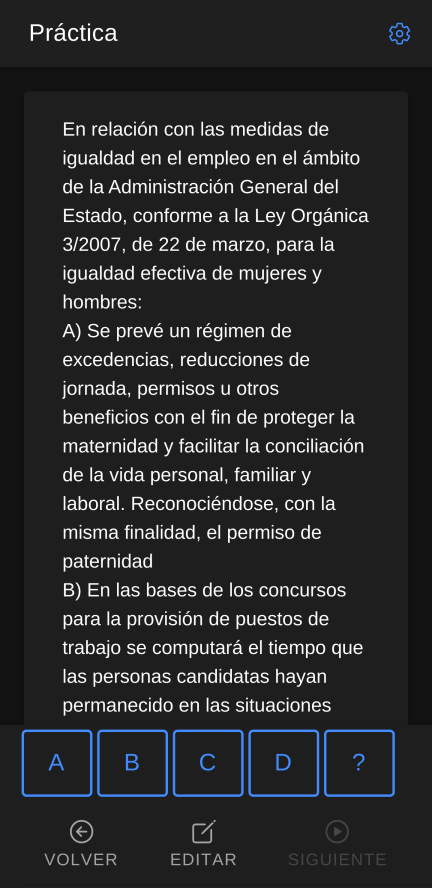
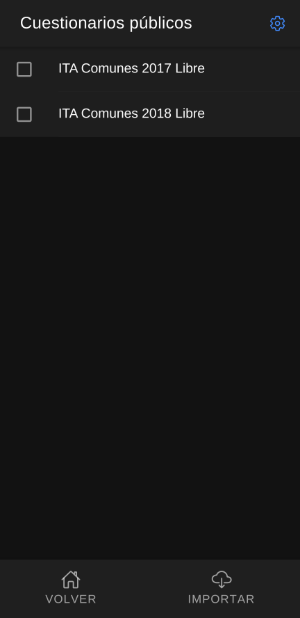

# dinatests

Webapp to make and practice quizzes.

It's an Ionic 6 vanilla Typescript and... AngularJS!!! project: no Angular, React, Vue
The webapp doesn't have a user/password login. Instead it generates a personal Token for you.
The frontend talks to a backend -at the moment there is no repo for it, but it will be soon- with a Rest API that stores que tokens, quizzes.. in a sqlite database.

## Features
* Light / Dark themes
* Google Recaptcha
* Algorithm to choose the next question based on answer date, number of hits and misses of each one
* Explore & Import public quizzes
* Export quizz as Anki deck

## Screenshots

## License

[MIT](LICENSE).
